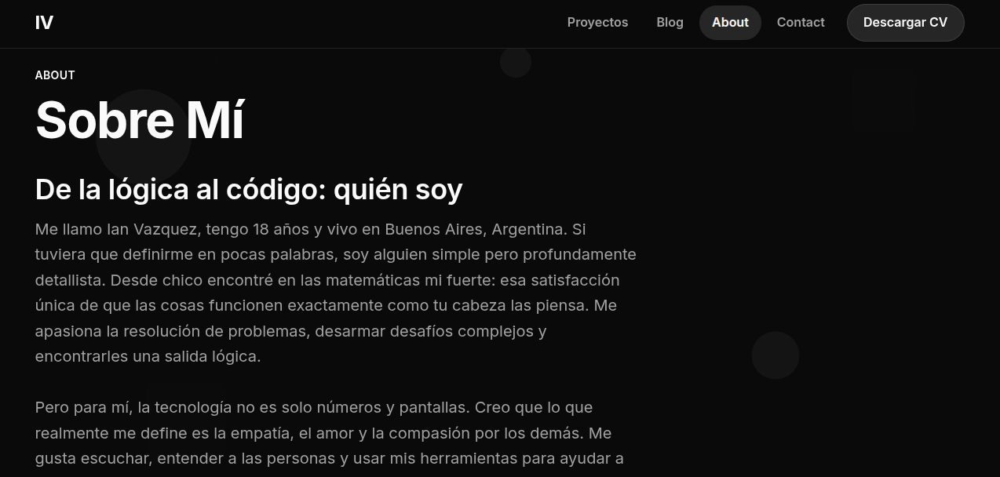
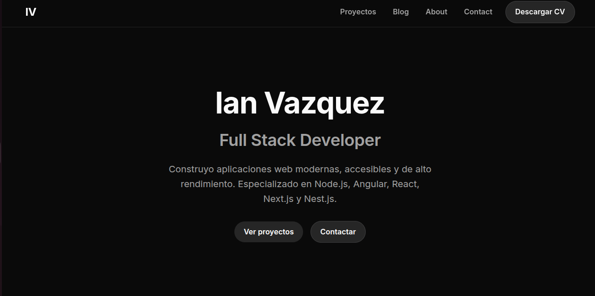
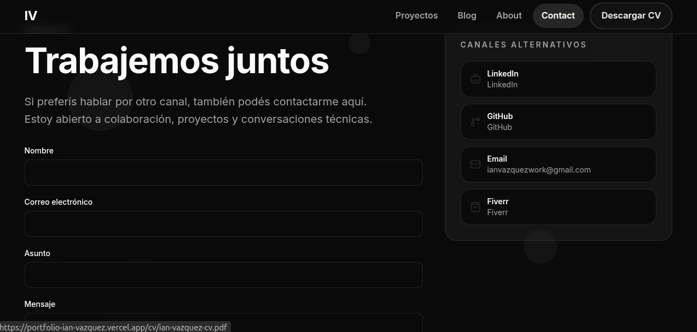
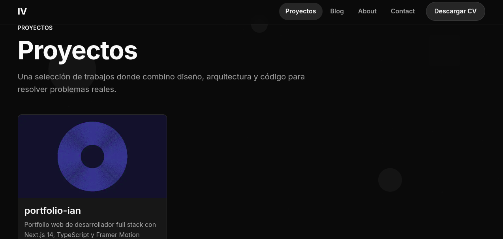

# Portfolio Ian Vazquez



Portfolio personal de alto rendimiento diseñado para showcase de proyectos y blog profesional. Construido con Next.js 14+, TypeScript, Tailwind CSS y Framer Motion.

[](https://nextjs.org/)
[](https://www.typescriptlang.org/)
[](https://tailwindcss.com/)
[](https://opensource.org/licenses/MIT)

## 🎯 Vista Previa





## 🚀 Stack Tecnológico

### Core
- **Next.js 14+** — App Router con React Server Components
- **TypeScript 5.6** — modo estricto para type safety
- **Tailwind CSS 3.4** — sistema custom de tokens y diseño responsive
- **Framer Motion** — animaciones fluidas y transiciones

### Funcionalidades
- **React Hook Form + Zod** — formularios optimizados y validación robusta
- **Resend** — envío de emails transaccionales
- **MDX** — contenido de proyectos y blog con Markdown + JSX
- **Playwright** — E2E tests automatizados

## 🏗️ Arquitectura e Implementación

### Estructura del Proyecto

```
src/
├── app/              # Next.js App Router
│   ├── (pages)/      # Páginas públicas
│   ├── api/          # API Routes (contacto)
│   └── layout.tsx    # Layout raíz con tema
├── components/       # Componentes React
│   ├── ui/          # Primitivas visuales reutilizables
│   ├── layout/      # Header, Footer, Navigation
│   ├── sections/    # Secciones de páginas (Hero, Projects, etc.)
│   ├── content/     # Componentes de contenido MDX
│   ├── forms/       # Formularios con validación
│   └── motion/      # Wrappers de animación
├── lib/             # Utilidades y helpers
│   ├── content/     # Loaders MDX personalizados
│   ├── email/       # Lógica de envío de emails
│   ├── motion/      # Variants de Framer Motion
│   ├── seo/         # Helpers de metadata
│   └── theme/       # Sistema de temas (Dark/Light)
└── styles/          # Estilos globales y tokens Tailwind
```

### Decisiones de Arquitectura

#### 1. Sistema de Temas Sin "Theme Flash"
**Problema:** Implementar Dark/Light mode sin el parpadeo inicial (theme flash) durante la hidratación de React.

**Solución:** Script inline inyectado antes de la hidratación que sincroniza el tema con localStorage y prefers-color-scheme.

```typescript
// Script inline en layout.tsx
const themeScript = `
  (function() {
    const theme = localStorage.getItem('theme') || 
      (window.matchMedia('(prefers-color-scheme: dark)').matches ? 'dark' : 'light');
    document.documentElement.classList.add(theme);
  })();
`;
```

#### 2. MDX para Contenido
**Decisión:** Usar MDX en lugar de un CMS headless o base de datos.

**Beneficios:**
- Contenido versionado con Git
- Zero latency (archivos locales)
- Componentes React interactivos en contenido
- Syntax highlighting integrado

#### 3. Server Components por Default
**Decisión:** Usar React Server Components (RSC) siempre que sea posible.

**Beneficios:**
- Reducción del bundle del cliente
- Mejor performance en initial load
- Data fetching en el servidor

#### 4. Validación Robusta con Zod
**Implementación:** Schemas Zod para:
- Frontmatter de MDX (validación de metadata de proyectos)
- Formulario de contacto (validación en cliente y servidor)
- API payloads

## ⚡ Performance Optimizations

### Métricas Actuales
- **Lighthouse Performance:** 95+
- **First Contentful Paint:** < 1s
- **Time to Interactive:** < 2s
- **Build Time:** ~11s

### Optimizaciones Implementadas
- Imágenes en formato WebP con optimización automática
- Code splitting automático de Next.js
- Lazy loading de componentes pesados
- Server Components para reducir bundle del cliente
- Tailwind CSS purging para CSS mínimo

## 🧪 Testing

### E2E Tests con Playwright
- Navegación entre páginas
- Formulario de contacto (con mocking de API)
- Responsive design en múltiples viewports
- Accesibilidad (a11y)

### Ejecutar Tests
```bash
npx playwright test
npx playwright show-report
```

## 📝 Configuración Local

### Prerrequisitos

- Node.js 20.x (LTS)
- npm

### Instalación

```bash
# Clonar el repositorio
git clone https://github.com/IanVazquez-FullStack/Portfolio-Ian-Vazquez
cd portfolio-ian

# Instalar dependencias
npm install
```

### Variables de Entorno

Crear un archivo `.env.local` en la raíz del proyecto con las siguientes variables:

```env
RESEND_API_KEY=your_resend_api_key
CONTACT_TO_EMAIL=your_email@example.com
CONTACT_FROM_EMAIL=noreply@yourdomain.com
NEXT_PUBLIC_SITE_URL=http://localhost:3000
```

**Nota:** `.env.local` nunca se debe commitear al repositorio. Las variables de referencia están en `.env.example`.

### Ejecutar en Desarrollo

```bash
npm run dev
```

Abrir [http://localhost:3000](http://localhost:3000) en el navegador.

## Deploy en Vercel

### Configuración Inicial

1. **Importar proyecto en Vercel:**
   - Ir a [vercel.com](https://vercel.com)
   - Click en "Add New Project"
   - Importar desde GitHub
   - Framework preset: Next.js

2. **Configurar variables de entorno en Vercel Dashboard:**
   - Ir a Settings → Environment Variables
   - Agregar las siguientes variables:
     - `RESEND_API_KEY` — clave de API de Resend
     - `CONTACT_TO_EMAIL` — email destino del formulario
     - `CONTACT_FROM_EMAIL` — email remitente
     - `NEXT_PUBLIC_SITE_URL` — URL de producción (ej. `https://portfolio-ian.vercel.app`)

3. **Deploy automático:**
   - Push a `main` → deploy automático a producción
   - Pull Requests → preview deployments automáticos

### Rotar Variables de Entorno

Para cambiar una variable de entorno en producción:

1. Ir a Vercel Dashboard → Settings → Environment Variables
2. Editar la variable deseada
3. Hacer un nuevo deploy (trigger manual o push a main)
4. Vercel aplicará las nuevas variables en el siguiente deploy

## CI/CD con GitHub Actions

El proyecto tiene un workflow de CI en `.github/workflows/ci.yml` que:

- Se ejecuta en cada push a `main` y en pull requests
- Corre `npm ci`, `npm run lint`, `tsc --noEmit` y `npm run build`
- Bloquea merges si alguna validación falla

### Branch Protection (Recomendado)

Para requerir que CI pase antes de merge:

1. Ir a GitHub Settings → Branches
2. Add rule para `main`
3. Habilitar "Require status checks to pass before merging"
4. Seleccionar el job de CI del workflow

## 🛠️ Scripts Disponibles

```bash
npm run dev          # Iniciar servidor de desarrollo
npm run build        # Build para producción
npm run start        # Iniciar servidor de producción
npm run lint         # Ejecutar ESLint
npm run type-check   # Verificar tipos con TypeScript
```

## 📐 Convenciones de Código

- TypeScript estricto obligatorio
- Alias de imports: usar `@/*` en vez de rutas relativas
- Server Components por default, `"use client"` solo cuando sea necesario
- Schemas Zod nombrados como `thingSchema`
- Components en PascalCase
- No usar `any`, preferir `unknown` con narrowing

## 🌐 Deploy en Producción

**Live Demo:** [portfolio-ian.vercel.app](https://portfolio-ian.vercel.app)

**Repositorio:** [github.com/IanVazquez-FullStack/Portfolio-Ian-Vazquez](https://github.com/IanVazquez-FullStack/Portfolio-Ian-Vazquez)

## 📄 Licencia

Este proyecto está bajo la Licencia MIT - ver el archivo [LICENSE](LICENSE) para detalles.

---

Desarrollado con ❤️ por [Ian Vazquez](https://github.com/IanVazquez-FullStack)
