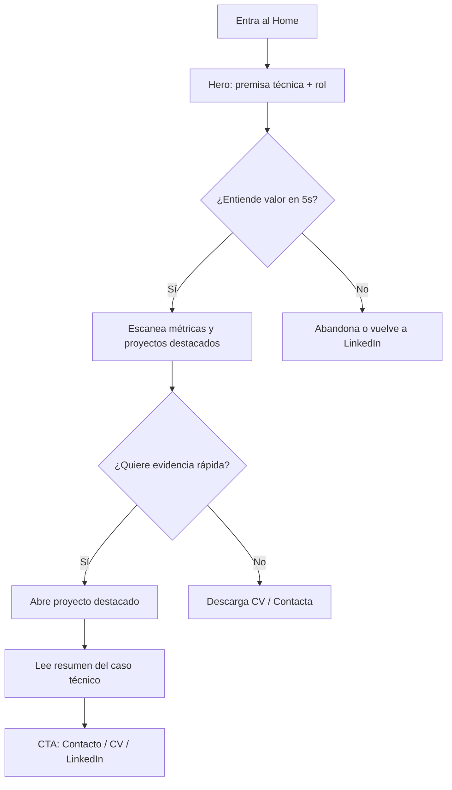
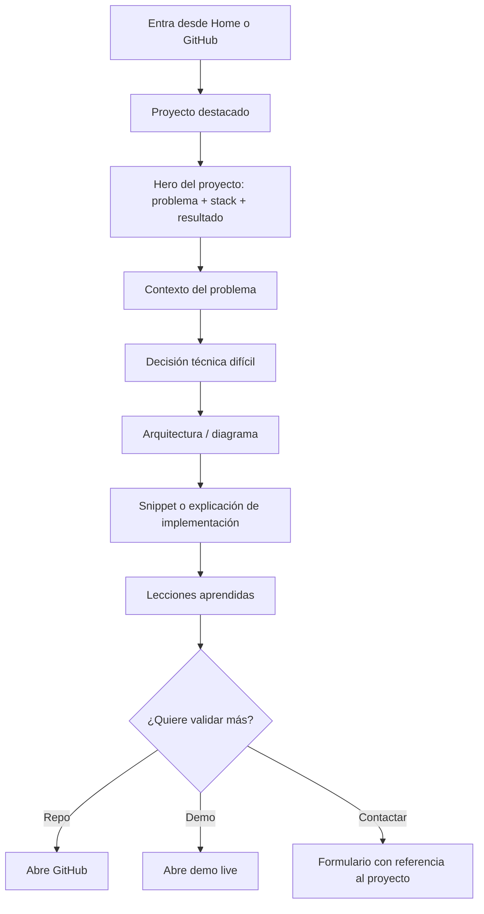
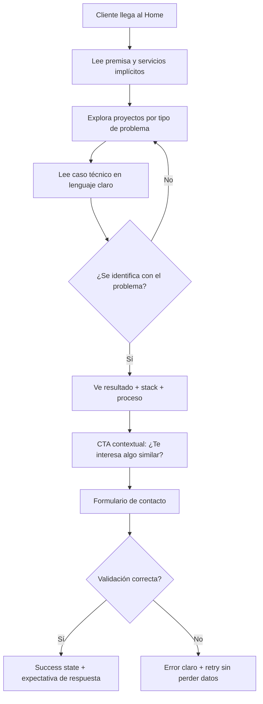
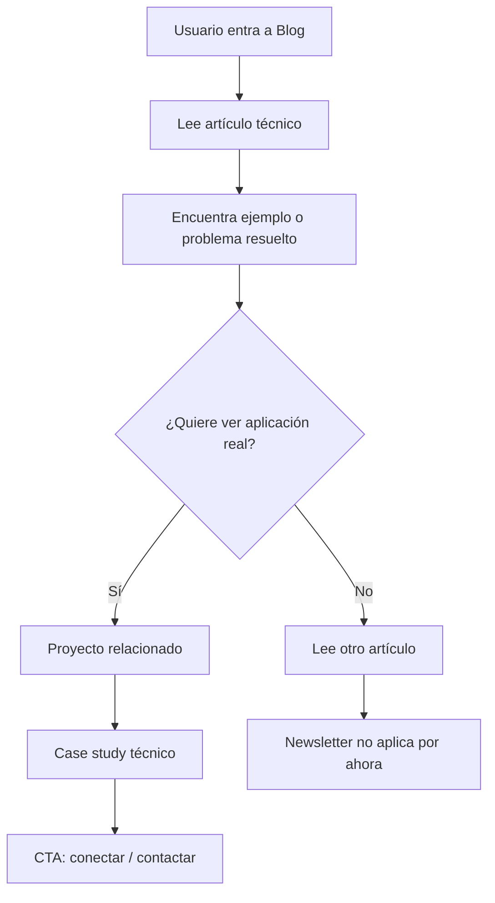

# UX Design Specification - portfolio-ian

**Author:** Ian
**Date:** 2026-05-25

---

<!-- UX design content will be appended sequentially through collaborative workflow steps -->

## Executive Summary

### Project Vision

Portfolio web que transforma visitas de reclutadores, empresas y clientes en oportunidades de contacto mediante demostración tangible de capacidades full stack. No es una lista de tecnologías — es evidencia de pensamiento técnico aplicado.

### Target Users

- **Reclutadores técnicos:** Buscan validar skills rápidamente. Necesitan ver código, arquitectura y decisiones técnicas sin fricción.
- **Reclutadores no técnicos:** Juzgan por presentación y profesionalismo visual. Necesitan claridad y confianza.
- **Hiring managers:** Evalúan fit cultural y capacidad de comunicación técnica. El "caso técnico" de cada proyecto es clave.
- **Clientes freelance:** Buscan credibilidad y ejemplos concretos de soluciones entregadas.
- **Desarrolladores (networking):** Juzgan calidad de código, animaciones y atención al detalle. Son los más exigentes.

### Key Design Challenges

1. **Credibilidad instantánea:** El usuario debe entender "este dev sabe lo que hace" en los primeros 5 segundos sin depender solo de texto.
2. **Dual audience:** Diseñar para reclutadores no técnicos (visual, limpio) y técnicos (profundidad, casos de estudio) simultáneamente.
3. **Performance vs. animaciones:** Framer Motion y scroll effects deben sentirse fluidos sin sacrificar Core Web Vitals.
4. **Escalabilidad de contenido:** El sistema de proyectos/blog debe permitir agregar contenido nuevo sin modificar código ni romper diseño.
5. **Conversión pasiva:** El contacto debe ser fácil pero no agresivo — el formulario no debe sentir como un popup intrusivo.

### Design Opportunities

1. **Micro-interacciones como señal de calidad:** Cada hover, transición y scroll effect refuerza la percepción de "atención al detalle" que un hiring manager valora.
2. **El "caso técnico" como diferenciador:** La mayoría de portfolios muestran screenshots; este portfolio explica decisiones difíciles, arquitectura y lecciones aprendidas. Esto es contenido que vende sin vender.
3. **Backend funcional visible:** El formulario de contacto con API real no solo sirve — demuestra que el portfolio *es* una aplicación full stack, no un sitio estático.
4. **Dark mode por defecto:** Posiciona el portfolio en la estética moderna de desarrolladores y transmite seriedad técnica.

### Visual Design Direction (Agent Consensus)

| Aspecto | Decisión | Razón |
|---------|----------|-------|
| **Estilo general** | Dark mode elegante con acentos de color | Portfolios de devs se ven más premium en dark mode; los reclutadores técnicos esperan esto |
| **Paleta base** | Slate/Zinc neutros (`#0f172a` a `#f8fafc`) | Transmite profesionalismo técnico sin distracciones |
| **Acento** | Cyan brillante (`#06b6d4`) | Señal de tecnología moderna, buen contraste en dark |
| **Tipografía** | Inter o Geist (sans-serif) + JetBrains Mono para código | Legible, moderna, estándar en tech |
| **Inspiración visual** | Rauno Freiberg + Josh Comeau | Minimalista con micro-interacciones cuidadas |
| **Densidad** | Espaciado generoso (aire entre secciones) | Facilita lectura, se siente "premium" |

### UX Insights from Agent Roundtable

**Sally (UX Designer):**
- Un portfolio no es un currículum bonito — es una aplicación con un job-to-be-done: "ayudame a decidir si contrato a esta persona en menos de 90 segundos."
- **Invertir la pirámide:** Empezar con prueba de valor inmediata (interactivo, snippet de código, métrica real) en lugar de "Hola soy Ian..."
- **Proyectos como casos, no como galería:** Cada proyecto necesita "antes/después" o "problema/decisión difícil/resultado"
- **Contacto con fricción positiva:** Debe ser el siguiente paso natural después de leer un caso técnico
- Framer Motion es herramienta, no decoración — cada animación responde a una pregunta del usuario

**Caravaggio (Presentation Expert):**
- **Regla del 60/30/10:** 60% negative space, 30% movimiento intencional, 10% color de acento violento
- El hero no necesita tu foto — necesita una **premisa**: "Full Stack Developer. I turn messy requirements into fast, working code"
- Dark mode por defecto con `prefers-color-scheme`, sin flash de white-on-load
- Cyan funciona si se usa con parquímetrald: si todo es cyan, nada es cyan

**Freya (WDS Designer):**
- Tres **Experience Pillars** para el portfolio:
  1. **Credibility through Craft:** Cada píxel transmite "alguien que se preocupa por los detalles"
  2. **Transparency through Depth:** El caso técnico estructurado como argumento: Contexto → Problema → Decisiones → Resultados
  3. **Invitation, not Interruption:** El contacto como invitación natural, no CTA de landing page
- El diseño de grid y template de caso técnico deben ser **sistemas, no one-offs** — diseñar el caso vacío antes del caso lleno
- El color debe guiar al ojo: Cyan para "importante", gris para "contexto", blanco para "acción"

---

## Core User Experience

### Defining Experience

El portfolio es una aplicación cuyo job-to-be-done es: **"Ayudame a decidir si contrato/contacto a esta persona en menos de 90 segundos."**

La acción principal del usuario (reclutador, hiring manager, cliente potencial) es **explorar proyectos para evaluar si Ian es el candidato adecuado**. Esa exploración debe culminar naturalmente en un punto de contacto.

El portfolio invierte la pirámide informativa: en lugar de empezar con una bio extensa, comienza con una prueba de valor inmediata — código, arquitectura y decisiones técnicas visibles desde el primer scroll.

### Platform Strategy

| Aspecto | Decisión |
|---------|----------|
| **Plataforma** | Web responsive (mobile-first) |
| **Framework** | Next.js 14+ App Router |
| **Hosting** | Vercel (serverless functions para API de contacto) |
| **Input primario** | Touch (mobile 60%+) y mouse/keyboard (desktop) |
| **Offline** | No requerido |
| **Reduced motion** | Respetar `prefers-reduced-motion` obligatorio |
| **Browser support** | Chrome, Firefox, Safari, Edge últimas 2 versiones |

### Effortless Interactions

- **Scroll entre secciones:** Navegación suave con anclas funcionales y progreso visual
- **Lectura de casos técnicos:** Jerarquía visual clara — nunca muro de texto. Estructura argumental: Contexto → Problema → Decisiones → Resultados
- **Formulario de contacto:** Validación en tiempo real, estados de UI claros (loading/success/error), protección anti-spam transparente
- **Toggle tema:** Sin flash de tema incorrecto en carga. Detectar `prefers-color-scheme` como default, persistir en localStorage
- **Navegación de proyectos:** Transiciones suaves entre listado y detalle con AnimatePresence

### Critical Success Moments

1. **Segundo 0-5 (Hero):** El usuario ve el hero y entiende "full stack dev, nivel profesional" — sin leer un párrafo
2. **Minuto 0-1 (Primer proyecto):** El usuario abre un proyecto y descubre que no es solo screenshot — hay arquitectura, decisiones difíciles, lecciones aprendidas
3. **Minuto 2+ (Contacto):** El usuario llega al formulario de contacto *porque quiere*, no porque se lo pidieron agresivamente

### Experience Principles

1. **Show, don't tell:** Cada sección demuestra habilidad, no la describe. El portfolio *es* la prueba de capacidad full stack.
2. **Depth without density:** Profundidad técnica presentada con aire, jerarquía visual y estructura argumental. Nunca información sin contexto.
3. **Motion with meaning:** Animaciones que guían (¿esto es clickable? ¿dónde estoy? ¿qué pasó?), no que decoran. Framer Motion como herramienta de UX, no de efectos especiales.
4. **Scale without breakage:** El diseño funciona con 3 proyectos o con 15. El grid y el template de caso técnico son sistemas, no one-offs.

---

## Desired Emotional Response

### Primary Emotional Goals

1. **Respeto inmediato:** Al ver el hero, el usuario siente "esto no es un portfolio genérico de WordPress. Este dev se preocupa por los detalles."
2. **Confianza técnica:** Al explorar proyectos, el usuario siente "este tipo piensa en profundidad. No solo escribe código — toma decisiones difíciles y las documenta."
3. **Invitación natural:** Al llegar al contacto, el usuario siente "quiero hablar con esta persona. Su trabajo habla por sí solo."
4. **Recuerdo de calidad:** Al cerrar la pestaña, el usuario siente "recordé este portfolio. Es referencia de lo que debería ser un portfolio de dev."

### Emotional Journey Mapping

| Etapa | Emoción deseada | Emoción a evitar |
|-------|----------------|------------------|
| **Descubrimiento (hero, 0-5s)** | Curiosidad + respeto técnico | Indiferencia, "ya vi esto antes" |
| **Exploración (proyectos, 0-2min)** | Confianza + interés genuino | Confusión, abrumamiento |
| **Profundización (caso técnico, 2-5min)** | Admiración por la transparencia | Sospecha de exageración, "esto es humo" |
| **Contacto** | Invitación natural, sin presión | Ansiedad, desconfianza |
| **Error (form, 404)** | Tranquilidad, control total | Frustración, abandono |
| **Retorno (re-visita)** | Familiaridad + recuerdo positivo | "¿qué era esto otra vez?" |

### Micro-Emotions

- **Confianza vs. Confusión:** La jerarquía visual debe ser inmediata. Nunca "¿dónde estoy? ¿qué hago?"
- **Confianza vs. Sospecha:** El "caso técnico" transparente genera credibilidad. Ocultar detalles genera duda.
- **Satisfacción vs. Frustración:** Las animaciones deben sentirse fluidas (60fps), nunca laggy. Un portfolio que se traba mientras habla de performance es contradictorio.
- **Delight sutil:** Un hover state bien hecho, una transición de página que responde — pequeños momentos de "nice" que suman a la percepción de calidad.
- **Pertenencia (para devs):** Cuando un desarrollador ve el código syntax-highlighted, la arquitectura diagramada, las decisiones documentadas — siente "este es mi mundo, este habla mi idioma."

### Design Implications

| Emoción | Decisión de UX |
|---------|---------------|
| **Confianza inmediata** | Hero sin foto personal, con premisa técnica y métrica real (ej. "99 Lighthouse score") |
| **Transparencia** | Caso técnico estructurado como argumento: Contexto → Problema → Decisiones → Resultados |
| **Control** | Estados de formulario claros, validación en tiempo real, retry en errores, sin sorpresas |
| **Calma profesional** | Espaciado generoso, dark mode por defecto, sin elementos que compitan por atención |
| **Orgullo técnico** | Código syntax-highlighted, arquitectura diagramada, decisiones documentadas, stack completo visible |
| **Delight sutil** | Hover states con micro-animaciones, transiciones de página suaves, scroll reveals que revelan contenido progresivamente |

### Emotional Design Principles

1. **Respect the user's intelligence:** No uses copy de marketing vacío. Cada palabra debe aportar valor o ser eliminada.
2. **Consistency breeds trust:** Si el portfolio dice "performance-optimized", debe cargar en < 2s. Si dice "atención al detalle", no debe haber un `border-radius` inconsistente.
3. **Surprise with depth, not with noise:** El "wow" del portfolio no viene de un fondo 3D que gira — viene de descubrir que un proyecto tiene una explicación arquitectural de 500 palabras que demuestra pensamiento real.
4. **Errors are opportunities:** Un 404 bien diseñado, un mensaje de error del formulario con retry claro — estos momentos construyen más confianza que el flujo feliz.

---

## UX Pattern Analysis & Inspiration

### Inspiring Products Analysis

**1. Rauno Freiberg (`rauno.me`)**
- **Qué hace bien:** Minimalismo extremo con micro-interacciones que demuestran dominio técnico. Cada hover, cada transición dice "esto lo hizo alguien que sabe".
- **Patrón transferible:** La densidad informativa baja como señal de confianza. No necesita gritar para demostrar valor.
- **Para el portfolio:** Espaciado generoso, animaciones sutilísimas que solo los devs notan, tipografía impecable.

**2. Josh Comeau (`joshwcomeau.com`)**
- **Qué hace bien:** Usa Framer Motion para crear una experiencia de lectura inmersiva. Sus "mini-apps" interactivas dentro de artículos técnicos demuestran habilidad mientras educan.
- **Patrón transferible:** Contenido interactivo como demostración de habilidad. No solo leés sobre React — usás React en la página.
- **Para el portfolio:** El "caso técnico" de cada proyecto podría incluir un snippet interactivo o una visualización de arquitectura.

**3. GitHub (perfil de desarrollador)**
- **Qué hace bien:** Los reclutadores técnicos pasan horas aquí. La estructura de "repositorios → README → código" es el estándar mental de evaluación técnica.
- **Patrón transferible:** Jerarquía de información: título → descripción → detalles técnicos → código.
- **Para el portfolio:** La página de proyecto individual debería seguir una lógica similar: título → premisa → stack → caso técnico → código/links.

**4. Vercel Dashboard**
- **Qué hace bien:** Dark mode por defecto, cyan acento, información técnica presentada con claridad visual, performance metrics prominentes.
- **Patrón transferible:** El uso de color funcional: cyan para acciones/estados activos, gris para contexto, verde para éxito.
- **Para el portfolio:** Dark + cyan es literalmente el lenguaje visual de la infraestructura moderna. Los reclutadores técnicos reconocen esto instintivamente.

### Transferable UX Patterns

| Patrón | Fuente | Uso en Portfolio |
|--------|--------|------------------|
| **Hero con premisa, no con foto** | Josh Comeau, Rauno | Hero: premisa técnica + métrica real |
| **Scroll reveal progresivo** | Rauno | Cada sección aparece al scrollear, revelando contenido como descubrimiento |
| **Hover states informativos** | GitHub | Cards de proyecto que revelan stack técnico en hover |
| **Dark mode como identidad** | Vercel, Vite, shadcn/ui | Dark por defecto = "soy parte de este ecosistema" |
| **Code blocks integrados** | Josh Comeau | Casos técnicos con syntax highlighting, no solo texto |

### Anti-Patterns to Avoid

1. **Portfolio-template effect:** Usar un tema de portfolio pre-armado (como los de ThemeForest) mata toda credibilidad. Los devs notan los templates al instante.
2. **Wall of text en casos técnicos:** Un caso técnico sin jerarquía visual, sin código, sin diagramas — es un blog post aburrido, no una demostración.
3. **Animaciones por default:** Transiciones de página genéricas, loading spinners de librería sin personalización, parallax de tutorial de YouTube — señalan falta de criterio propio.
4. **Contacto escondido:** El formulario en el footer, sin contexto, sin razón para contactar. Si el usuario no llegó al contacto *convencido*, no va a enviar el formulario.
5. **Screenshots sin contexto:** Mostrar un screenshot de un dashboard y decir "aplicación de gestión". Eso no demuestra nada. Demostrá *qué problema resolviste*.

### Design Inspiration Strategy

**Adoptar:**
- Minimalismo de Rauno (aire, negative space, tipografía como protagonista)
- Interactividad de Josh (contenido que demuestra mientras explica)
- Jerarquía de GitHub (título → descripción → detalles → acción)

**Adaptar:**
- Dark+cyan de Vercel para el sistema de color, pero con una voz personal (no copiar los tokens exactos)
- Scroll animations de Framer Motion, pero customizadas al ritmo de lectura del caso técnico

**Evitar:**
- Efectos 3D de Bruno Simon (a menos que sea relevante para un proyecto específico — espectacular pero desvía del propósito)
- Cualquier patrón de "portfolio template" genérico
- Animaciones que no responden a una necesidad del usuario

---

## Design System Foundation

### 1.1 Design System Choice

**Tailwind CSS Custom (sin design system pre-armado)** + shadcn/ui selectivo para componentes complejos (Dialog, Sheet).

El PRD ya confirma Tailwind CSS como styling base. La decisión es: ¿usar un design system pre-armado encima de Tailwind, o construir uno propio?

| Opción | Pros | Cons | Veredicto |
|--------|------|------|-----------|
| **shadcn/ui completo** | Componentes accesibles, copia-paste, compatible Tailwind | Puede verse genérico si no se customiza profundamente; más orientado a dashboards | Considerar selectivamente |
| **Material Design (MUI)** | Accesibilidad probada, componentes robustos | Look genérico de Google; mata diferenciación; no encaja con dark+cyan | **Descartado** |
| **Chakra UI** | Flexibilidad, theming fácil | Menos popular ahora; puede parecer dated | **Descartado** |
| **Tailwind Custom + componentes propios** | Control total, diferenciación 100%, demuestra habilidad | Más trabajo inicial | **✅ Recomendado** |

### Rationale for Selection

1. **Diferenciación:** Un portfolio que se ve diferenciado no puede usar componentes genéricos. Los reclutadores técnicos notan shadcn/ui al instante. Si el objetivo es "se nota el nivel de detalle", los componentes deben ser propios.

2. **Tailwind ya ES un sistema de diseño:** Con tokens de color, espaciado, tipografía y breakpoints bien definidos en `tailwind.config.ts`, se obtiene consistencia sin librerías externas.

3. **shadcn/ui selectivo:** Usar piezas muy específicas de shadcn (ej: Dialog, Sheet para mobile menu) si ahorran tiempo, pero customizadas con tokens propios. No instalar shadcn completo.

4. **Demuestra habilidad:** Un dev que puede construir un sistema de componentes propios para su portfolio transmite más que uno que instala MUI.

5. **Stack PRD confirmado:** Next.js + Tailwind es la base. No hay conflicto con librerías adicionales.

### Implementation Approach

1. **Configurar Tailwind tokens personalizados** en `tailwind.config.ts`
2. **Construir componentes base propios:** Button, Card, Badge, Link (los más simples, customizados)
3. **shadcn/ui selectivo:** Solo para componentes complejos que no valen la pena reimplementar (Dialog, Sheet, Command)
4. **Crear sistema de animaciones con Framer Motion:** Variants reutilizables para fade-in, slide-up, stagger

### Customization Strategy

**Tokens de color propuestos:**

```ts
// tailwind.config.ts (extracto)
colors: {
  background: '#0f172a',      // slate-900
  foreground: '#f8fafc',        // slate-50
  accent: '#06b6d4',            // cyan-500
  'accent-hover': '#22d3ee',    // cyan-400
  muted: '#475569',             // slate-600
  'muted-foreground': '#94a3b8', // slate-400
  border: '#1e293b',            // slate-800
  'border-hover': '#334155',    // slate-700
}
```

**Tipografía:**
- **Body:** Inter o Geist (sans-serif)
- **Code:** JetBrains Mono
- **Headings:** Inter con weights 400/500/700

**Espaciado:**
- Scale personalizado basado en Tailwind default pero con secciones más generosas (ej. `py-32` entre secciones en desktop)

**Componentes a construir:**
- `Button` — variantes: primary (accent), secondary (border), ghost
- `Card` — para proyectos, blog posts
- `Badge` — para tech stack tags
- `Section` — wrapper con padding y max-width consistentes
- `AnimatedSection` — wrapper con scroll reveal

---

## Core User Experience (Defining Experience)

### 2.1 Defining Experience

> **"Explorar un proyecto y descubrir que hay pensamiento real detrás del código — no solo screenshots, sino arquitectura, decisiones difíciles y lecciones aprendidas."**

Esta es la interacción que, si se clava, todo lo demás sigue. Es lo que diferencia este portfolio de los 10.000 genéricos que muestran screenshots sin contexto.

### 2.2 User Mental Model

**¿Cómo evalúan un dev actualmente los reclutadores?**

1. **LinkedIn/GitHub →** Ven stacks, commits, repos. Pero no ven *cómo piensa*.
2. **Portfolio genérico →** Ven screenshots, lista de tecnologías. Dicen "sí, sabe React".
3. **Portfolio con caso técnico →** Ven una decisión documentada, un trade-off explicado. Dicen "este tipo resuelve problemas reales".

El mental model que traen los usuarios: *"Los portfolios mienten. Todos se ven iguales. Nunca sé si el dev realmente hizo esto o solo deployó un template."*

Nuestro trabajo es **romper ese mental model** mostrando transparencia extrema. Cada proyecto no solo muestra el resultado — muestra el proceso de pensamiento que llevó allí.

### 2.3 Success Criteria

| Criterio | Indicador de éxito |
|----------|-------------------|
| **Claridad en 90 segundos** | El usuario entiende el problema del proyecto sin leer más de 2 párrafos |
| **Profundidad escalable** | El usuario puede quedarse 30 segundos (scan) o 5 minutos (deep dive) |
| **Confianza técnica** | El usuario siente "esto no es humo" al ver decisiones difíciles documentadas |
| **Natural flow to contact** | El usuario llega al formulario convencido, no curioseando |

### 2.4 Novel UX Patterns

**Mayormente established patterns con un twist:**

- **Scroll one-page** → Established (todos los portfolios lo hacen)
- **Caso técnico estructurado** → **NOVEDAD** en portfolios personales. Los blogs técnicos lo hacen, los portfolios no.
- **Formulario con backend real** → **NOVEDAD** demostrable. La mayoría usa Formspree o Netlify Forms. Este portfolio usa API propia con Resend.
- **Dark mode como identidad** → Established en tech, pero novedad en portfolios personales

**El twist:** El portfolio *es* una demostración de full stack. No solo *muestra* proyectos — *demuestra* habilidades con cada interacción. El formulario funcional, las animaciones fluidas, el performance optimizado — todo es parte de la prueba de capacidad.

### 2.5 Experience Mechanics

**Flujo del caso técnico (la experiencia core):**

```
1. INITIATION
   └── Usuario ve card de proyecto en grid
   └── Hover revela stack técnico + tipo de proyecto
   └── Click → transición suave a página de detalle

2. INTERACTION
   └── Hero del proyecto: título + premisa + screenshot principal
   └── Scroll → Contexto del problema (¿por qué existía este proyecto?)
   └── Scroll → La decisión difícil (¿qué elegí y por qué?)
   └── Scroll → Arquitectura (diagrama/stack visual)
   └── Scroll → Lecciones aprendidas
   └── Scroll → Links a demo + repo + "¿Te interesa algo similar?"

3. FEEDBACK
   └── Scroll reveals progresivos indican progreso
   └── Código syntax-highlighted = "esto es real"
   └── Diagrama de arquitectura = "esto fue pensado"
   └── Micro-animations = "esto es cuidado"

4. COMPLETION
   └── Usuario llega a CTA final: "¿Trabajemos juntos?"
   └── Contacto pre-cargado con referencia al proyecto que acaba de leer
   └── Opciones de contacto múltiples: formulario, email directo, LinkedIn
```

---

## Visual Design Foundation

### Color System

**Paleta dark (default):**

| Token | Color | Uso |
|-------|-------|-----|
| `background` | `#0f172a` (slate-900) | Fondo principal |
| `foreground` | `#f8fafc` (slate-50) | Texto principal |
| `accent` | `#06b6d4` (cyan-500) | Botones primarios, links, highlights |
| `accent-hover` | `#22d3ee` (cyan-400) | Hover states de accent |
| `muted` | `#475569` (slate-600) | Texto secundario, borders sutiles |
| `muted-foreground` | `#94a3b8` (slate-400) | Descripciones, captions |
| `border` | `#1e293b` (slate-800) | Cards, dividers |
| `border-hover` | `#334155` (slate-700) | Hover de cards |
| `success` | `#22c55e` (green-500) | Estados de éxito del formulario |
| `error` | `#ef4444` (red-500) | Estados de error |

**Paleta light (alternativa):** Tailwind slate-50 background, slate-900 foreground, mismo cyan accent. Invertir los muted tokens proporcionalmente.

### Typography System

| Nivel | Font | Size | Weight | Line Height | Uso |
|-------|------|------|--------|-------------|-----|
| Display | Inter | 4rem (64px) | 700 | 1.1 | Hero headline |
| H1 | Inter | 2.5rem (40px) | 700 | 1.2 | Página de proyecto |
| H2 | Inter | 1.875rem (30px) | 600 | 1.3 | Sección headings |
| H3 | Inter | 1.5rem (24px) | 600 | 1.4 | Subsecciones, card titles |
| Body | Inter | 1rem (16px) | 400 | 1.6 | Párrafos generales |
| Body Large | Inter | 1.125rem (18px) | 400 | 1.6 | Intro text, hero subtitle |
| Caption | Inter | 0.875rem (14px) | 400 | 1.5 | Tech stack, metadata |
| Code | JetBrains Mono | 0.875rem (14px) | 400 | 1.6 | Snippets, inline code |

**Scale fluid:** En viewports < 768px, Display baja a 2.5rem, H1 a 1.875rem, H2 a 1.5rem.

### Spacing & Layout Foundation

**Base unit:** 4px (Tailwind default)

**Secciones:**
- Padding vertical desktop: `py-32` (128px)
- Padding vertical mobile: `py-20` (80px)
- Max-width contenido: `max-w-7xl` (1280px)
- Padding horizontal: `px-6` mobile → `px-8` tablet → `px-12` desktop

**Grid de proyectos:**
- Desktop: 2-3 columnas (`grid-cols-3`), gap `gap-8`
- Tablet: 2 columnas
- Mobile: 1 columna

**Cards:**
- Border radius: `rounded-xl` (12px) para cards principales
- Border radius: `rounded-lg` (8px) para badges, botones
- Padding interno: `p-6` para cards de proyecto
- Border: `border border-border` (1px slate-800)

### Accessibility Considerations

1. **Motion:** Respetar `prefers-reduced-motion` — si está activo, desactivar scroll reveals y transiciones, usar instantáneas.
2. **Focus states:** Todos los elementos interactivos tienen `focus-visible` ring con color accent.
3. **Color contrast:** Ratios verificados con slate-900 + slate-50 (>12:1), accent sobre background (>4.5:1).
4. **Font size:** Nunca menos de 14px (0.875rem) para body text.
5. **Touch targets:** Mínimo 44x44px en mobile para botones y links.

---

## Design Direction Decision

### Design Directions Explored

Se generó un showcase HTML con seis direcciones visuales en:

`_bmad-output/planning-artifacts/ux-design-directions.html`

Direcciones exploradas:

1. **Technical Minimal:** Dark, ultra limpio, micro-interacciones sutiles, foco en negative space y tipografía.
2. **Code Narrative:** Narrativa técnica desde el primer frame, snippets y estructura de caso técnico.
3. **Vercel-inspired Premium:** Dark+cyan, métricas visibles, lenguaje visual de infraestructura moderna.
4. **Editorial Developer:** Enfoque de publicación técnica premium para blog y casos largos.
5. **Interactive Case Study:** Proyecto como historia visual por etapas: problema → decisiones → resultado.
6. **Dashboard Craft:** Portfolio como app full stack viva, con métricas, estados y componentes funcionales.

### Chosen Direction

La dirección elegida es una combinación:

- **Base visual:** Technical Minimal
- **Narrativa de contenido:** Code Narrative
- **Señal técnica/premium:** Vercel-inspired Premium
- **Páginas de proyecto:** Interactive Case Study

Esta combinación evita el efecto de template genérico y refuerza el diferenciador principal del portfolio: demostrar pensamiento técnico real mediante casos técnicos claros, visuales y escalables.

### Design Rationale

1. **Technical Minimal** aporta madurez, foco y sensación premium. El portfolio no compite por atención con efectos innecesarios.
2. **Code Narrative** conecta directamente con la promesa de demostrar pensamiento técnico, no solo listar tecnologías.
3. **Vercel-inspired Premium** habla el lenguaje visual de la audiencia técnica moderna: dark mode, cyan funcional, métricas, performance.
4. **Interactive Case Study** convierte cada proyecto en una historia navegable con contexto, decisiones, arquitectura y lecciones aprendidas.

### Implementation Approach

- El home usará una estructura minimalista con hero fuerte, métricas puntuales y proyectos destacados.
- Las cards de proyecto tendrán micro-interacciones informativas: hover con stack técnico y tipo de problema resuelto.
- Las páginas de proyecto serán casos técnicos narrativos: Contexto → Problema → Decisiones → Arquitectura → Resultado → Contacto.
- Las métricas de calidad (performance, accesibilidad, backend funcional) aparecerán como señales visuales, no como claims vacíos.
- El movimiento será sutil y significativo: scroll reveal, stagger de cards, transiciones suaves y respeto obligatorio por `prefers-reduced-motion`.

---

## User Journey Flows

### Recruiter Quick Scan

**Objetivo:** Validar rápidamente quién es Ian, qué hace y si vale la pena contactar o descargar el CV.



**Optimización:** El hero debe resolver la pregunta “¿quién sos y por qué importás?” sin depender de una biografía larga.

### Technical Deep Dive

**Objetivo:** Permitir que un reclutador técnico, hiring manager o desarrollador evalúe profundidad real.



**Optimización:** La página debe soportar lectura de 30 segundos y deep dive de 5 minutos mediante progressive disclosure.

### Freelance Client Evaluation

**Objetivo:** Ayudar a un potencial cliente a sentir confianza y entender que Ian puede resolver problemas reales.



**Optimización:** El copy debe evitar jerga innecesaria cuando el usuario no es técnico, pero permitir profundidad si la busca.

### Blog-to-Contact Journey

**Objetivo:** Convertir artículos técnicos en señales de expertise que lleven a proyectos o contacto.



**Optimización:** Cada post debe tener al menos un enlace contextual a proyecto relacionado o a contacto.

### Journey Patterns

**Navigation Patterns:**
- Header persistente con links a secciones críticas: Proyectos, Blog, About, Contact.
- CTAs contextuales al final de cada proyecto y post.
- Breadcrumb o link “volver a proyectos” en páginas de detalle.

**Decision Patterns:**
- Primer nivel: scan rápido (cards, métricas, badges).
- Segundo nivel: explicación breve (resumen de caso).
- Tercer nivel: deep dive técnico (decisiones, arquitectura, código).

**Feedback Patterns:**
- Hover reveal para indicar interactividad.
- Scroll reveal para mostrar progreso narrativo.
- Estados de formulario explícitos: idle, validating, loading, success, error.

### Flow Optimization Principles

1. **Minimize time-to-credibility:** El usuario debe ver evidencia de calidad antes de tener que navegar mucho.
2. **Progressive disclosure:** No mostrar toda la profundidad técnica de golpe; revelar por capas.
3. **Contextual CTAs:** Contacto aparece cuando el usuario ya tiene una razón para contactar.
4. **No dead ends:** Todo proyecto, post y página secundaria debe ofrecer siguiente paso claro.
5. **Error recovery without data loss:** Si falla el formulario, no se pierde lo escrito.

---

## Component Strategy

### Design System Components

La estrategia base es **Tailwind CSS Custom** con componentes propios y uso selectivo de shadcn/ui solo para primitivas complejas.

**Componentes disponibles por sistema:**
- Tailwind CSS: tokens, spacing, responsive utilities, dark mode, focus states.
- Framer Motion: animaciones reutilizables (`fadeIn`, `slideUp`, `stagger`, page transitions).
- shadcn/ui selectivo: `Dialog` / `Sheet` para navegación mobile si acelera desarrollo sin sacrificar diferenciación.

### Custom Components

#### Button

**Purpose:** Acciones primarias y secundarias del portfolio.  
**Usage:** CTAs de hero, contacto, links a demo/repo, navegación.  
**States:** default, hover, active, focus-visible, disabled, loading.  
**Variants:** `primary`, `secondary`, `ghost`, `link`.  
**Accessibility:** Usar `button` real cuando ejecuta acción; `a` cuando navega. Focus ring visible con accent.

#### ProjectCard

**Purpose:** Presentar proyecto como entrada a un caso técnico, no como screenshot aislado.  
**Content:** título, descripción breve, stack, tipo de problema, preview visual, links.  
**States:** default, hover reveal, focus, reduced-motion.  
**Interaction Behavior:** Hover/focus revela stack y “qué problema resolvió”. Click lleva a detalle.  
**Accessibility:** Toda la card debe tener un link accesible o CTA claro; no depender solo del hover.

#### CaseStudyLayout

**Purpose:** Estructurar páginas de proyecto con narrativa técnica consistente.  
**Anatomy:** Hero → Contexto → Problema → Decisiones → Arquitectura → Código/Implementación → Resultados → CTA.  
**Variants:** proyecto completo, proyecto en progreso, proyecto sin demo pública.  
**Accessibility:** Headings jerárquicos, anchors internos, diagramas con texto alternativo.

#### TechStackBadges

**Purpose:** Mostrar tecnologías sin convertirlas en el mensaje principal.  
**Content:** nombre de tecnología, categoría opcional.  
**Variants:** compact, detailed, grouped.  
**Accessibility:** Texto visible; no usar solo logos.

#### ArchitectureDiagram

**Purpose:** Explicar decisiones técnicas visualmente.  
**Content:** nodos, relaciones, labels, notas breves.  
**Variants:** simple flow, system architecture, data flow.  
**Accessibility:** Descripción textual equivalente debajo o en `aria-describedby`.

#### CodeSnippet

**Purpose:** Demostrar implementación real o fragmentos representativos.  
**States:** default, copied, overflow scroll.  
**Variants:** inline, block, highlighted line.  
**Accessibility:** Contraste alto, scroll keyboard-friendly, botón “copiar” con feedback.

#### MetricCard

**Purpose:** Mostrar señales de calidad verificables: performance, accesibilidad, proyectos, respuesta del formulario.  
**Content:** número, label, contexto.  
**States:** default, hover, loading si viene de analytics futura.  
**Accessibility:** No depender solo del color para estados.

#### ContactForm

**Purpose:** Convertir intención en oportunidad de contacto.  
**Fields:** nombre, email, asunto, mensaje, honeypot.  
**States:** idle, validating, loading, success, error, retry.  
**Accessibility:** Labels visibles, errores asociados a campos, no perder datos en error.

#### BlogPostCard

**Purpose:** Presentar artículos técnicos como evidencia de expertise.  
**Content:** título, excerpt, fecha, tiempo de lectura, tags.  
**Interaction:** Link a artículo; CTA contextual a proyecto relacionado si aplica.

#### ThemeToggle

**Purpose:** Cambiar tema sin flash visual.  
**Behavior:** Detecta `prefers-color-scheme`, persiste preferencia en localStorage.  
**Accessibility:** `aria-label` dinámico y estado claro.

#### MobileNav

**Purpose:** Navegación mobile simple y accesible.  
**Implementation:** shadcn/ui `Sheet` o componente propio si es simple.  
**Accessibility:** Trap focus, Escape para cerrar, links grandes 44x44px mínimo.

### Component Implementation Strategy

- Construir componentes como unidades pequeñas y composables.
- Mantener variantes con utilidades tipo `class-variance-authority` si se incorpora shadcn/ui, o con helpers propios si se mantiene minimalista.
- Separar componentes de contenido (`ProjectCard`, `BlogPostCard`) de layout (`Section`, `Container`, `CaseStudyLayout`).
- Centralizar animaciones en wrappers (`AnimatedSection`, `StaggeredGrid`) para respetar `prefers-reduced-motion`.
- Crear componentes accesibles por defecto, no como ajuste posterior.

### Implementation Roadmap

**Phase 1 - Core Components:**
- `Button`, `Card`, `Badge`, `Section`, `Container`
- `HeroSection`, `ProjectCard`, `ProjectGrid`
- `ContactForm`

**Phase 2 - Case Study Components:**
- `CaseStudyLayout`
- `TechStackBadges`
- `ArchitectureDiagram`
- `CodeSnippet`
- `MetricCard`

**Phase 3 - Content & Polish:**
- `BlogPostCard`
- `ThemeToggle`
- `MobileNav`
- `AnimatedSection`
- `StaggeredGrid`

---

## UX Consistency Patterns

### Button Hierarchy

**Primary actions**
- Uso: contacto, ver proyecto destacado, enviar formulario.
- Visual: background `accent`, texto `foreground`, hover `accent-hover`.
- Comportamiento: transición sutil, focus ring visible, loading state cuando aplica.

**Secondary actions**
- Uso: GitHub, demo, descargar CV, leer más.
- Visual: border `border`, background transparente, hover con `border-hover`.
- Comportamiento: no compite con la acción primaria.

**Ghost actions**
- Uso: navegación secundaria, links internos, acciones de bajo peso.
- Visual: sin border por defecto, hover con cambio de color.
- Comportamiento: siempre debe tener estado focus claro.

### Feedback Patterns

**Success**
- Uso: formulario enviado, copia de snippet completada.
- Visual: verde `success`, mensaje breve, icono opcional.
- Copy: confirmar acción y expectativa siguiente (“Te respondo pronto”).

**Error**
- Uso: validación de formulario, API contact failure.
- Visual: rojo `error`, mensaje específico por campo o global.
- Comportamiento: no perder datos, ofrecer retry.

**Info**
- Uso: proyecto en desarrollo, blog sin posts suficientes, feature futura.
- Visual: cyan sutil, copy claro y no alarmista.

**Loading**
- Uso: envío de formulario, navegación/transición, carga de contenido.
- Visual: estado mínimo; preferir botón loading y skeleton sutil antes que spinners genéricos.

### Form Patterns

- Labels visibles siempre, no solo placeholders.
- Validación en tiempo real para email y campos requeridos.
- Errores asociados a campos con texto claro.
- Honeypot invisible para anti-spam.
- Submit deshabilitado solo mientras se envía o cuando hay errores evidentes.
- Success state reemplaza el formulario o aparece como panel claro.
- Error global conserva todos los valores ingresados.

### Navigation Patterns

- Header sticky con backdrop blur y border sutil.
- Home con smooth scroll a secciones.
- Páginas de detalle con link “Volver a proyectos”.
- Mobile nav con `Sheet` accesible o menú propio con focus trap.
- El header no debe ocupar demasiado espacio en mobile.
- Links activos indican sección actual cuando sea posible.

### Additional Patterns

**Empty states**
- Proyectos: si hay pocos proyectos, mostrar “más en preparación” sin parecer incompleto.
- Blog: mostrar artículos planeados o mensaje honesto si todavía está en construcción.

**404**
- Mensaje útil, tono humano, links a Home / Projects / Contact.
- Mantener estética del portfolio; el error también demuestra cuidado.

**Motion**
- Scroll reveal solo para introducir contenido, nunca para ocultar información crítica.
- Stagger para grids, máximo 80-120ms entre elementos.
- Desactivar o reducir animaciones con `prefers-reduced-motion`.

**Content hierarchy**
- Cada sección debe tener: eyebrow opcional, heading claro, párrafo corto, acción o evidencia.
- Casos técnicos siempre siguen: Contexto → Problema → Decisiones → Arquitectura → Resultado.

---

## Responsive Design & Accessibility

### Responsive Strategy

El portfolio seguirá una estrategia **mobile-first**. La experiencia debe sentirse completa en móvil, no como una versión reducida del desktop.

**Mobile**
- Layout de una columna.
- Navegación tipo Sheet accesible.
- Cards stacked.
- CTAs visibles y con targets táctiles adecuados.
- Tipografía fluid reducida para hero y headings.

**Tablet**
- Grid de 2 columnas para proyectos.
- Layouts menos densos que desktop pero con mayor aire que mobile.
- Navegación completa si el ancho lo permite; fallback a Sheet si no.

**Desktop**
- Grids 2-3 columnas.
- Layouts split para hero y case studies.
- Mayor uso de métricas, snippets y diagramas en paralelo.

**Wide**
- No expandir texto infinitamente.
- Mantener `max-w-7xl` para layout general y max-width menor para contenido largo.

### Breakpoint Strategy

Usar breakpoints estándar de Tailwind:

| Breakpoint | Rango | Uso |
|------------|-------|-----|
| Mobile | 320px - 767px | Layout de una columna |
| Tablet | 768px - 1023px | Dos columnas donde tenga sentido |
| Desktop | 1024px+ | Grids amplios y layouts split |
| Wide | 1280px+ | Max-width controlado, más aire |

### Accessibility Strategy

Target: **WCAG 2.1 AA**.

Requisitos:
- Contraste mínimo 4.5:1 para texto normal.
- Soporte completo de navegación por teclado.
- Focus visible en todos los elementos interactivos.
- Touch targets mínimos de 44x44px.
- Labels visibles en formularios.
- Mensajes de error asociados al campo correspondiente.
- Diagramas con alternativa textual.
- Respeto obligatorio por `prefers-reduced-motion`.
- Estructura semántica con `header`, `main`, `section`, `article`, `footer`.
- Skip link para saltar navegación principal.

### Testing Strategy

**Responsive Testing**
- Chrome DevTools para breakpoints principales.
- Validación manual en al menos un teléfono real.
- Verificar Safari/iOS para sticky header, input focus y viewport height.

**Accessibility Testing**
- Lighthouse accessibility.
- Axe DevTools.
- Navegación keyboard-only.
- VoiceOver o NVDA para lectura básica.
- Revisión manual de contraste en dark y light mode.

**Performance Testing**
- Lighthouse Performance > 90.
- Core Web Vitals: LCP < 2.5s, INP < 200ms, CLS < 0.1.
- Probar con `prefers-reduced-motion`.

### Implementation Guidelines

- Usar unidades relativas (`rem`, `%`, `clamp`) para tipografía y spacing cuando aplique.
- Evitar widths fijos para contenido.
- Usar `next/image` para imágenes con dimensiones declaradas.
- Usar `sizes` responsive para screenshots de proyectos.
- Mantener DOM semántico antes de agregar ARIA.
- ARIA solo cuando HTML nativo no sea suficiente.
- Formulario con `aria-invalid`, `aria-describedby` y mensajes persistentes.
- No depender solo del color para indicar estado.
- Animaciones limitadas a `transform` y `opacity` para performance.

---

